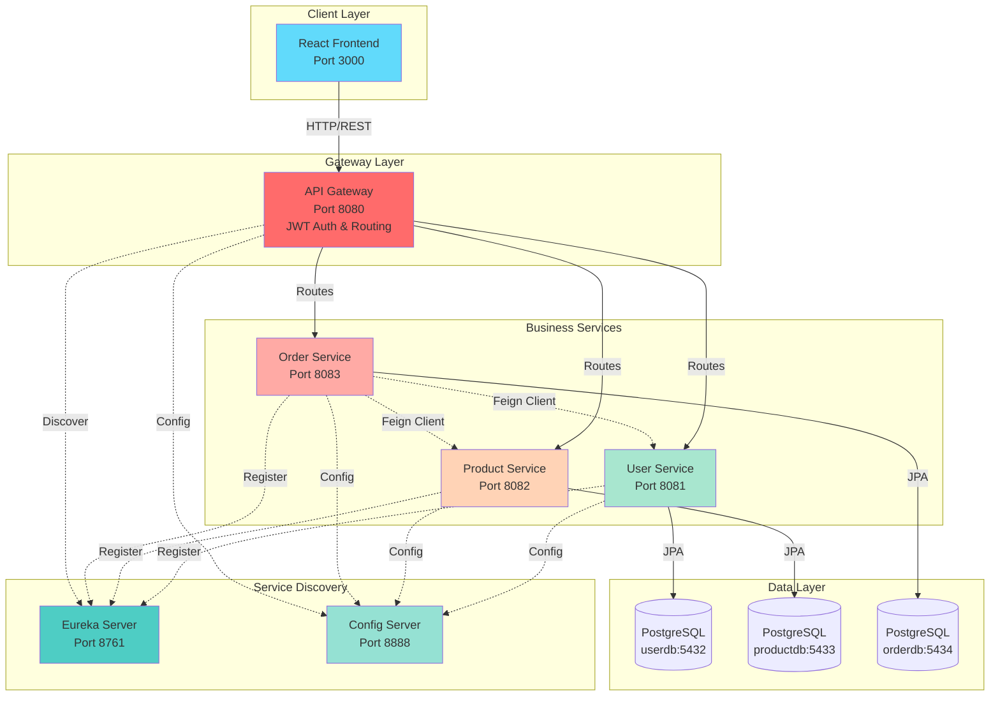
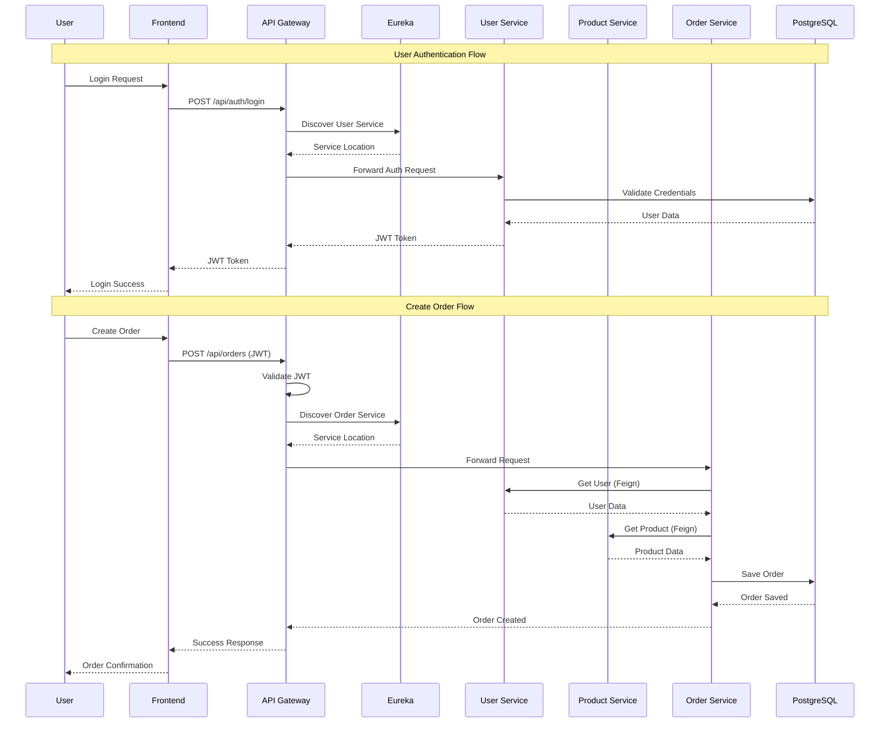
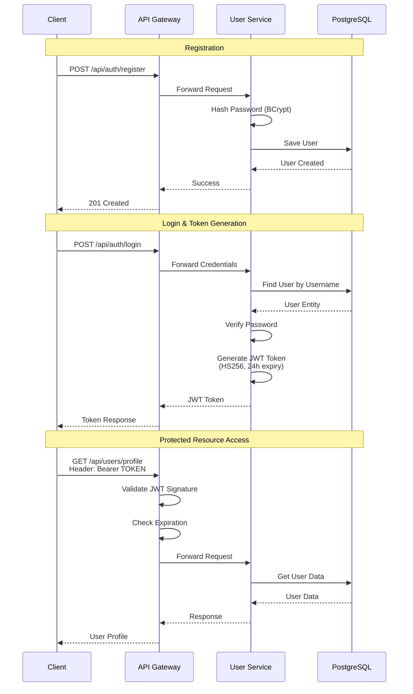
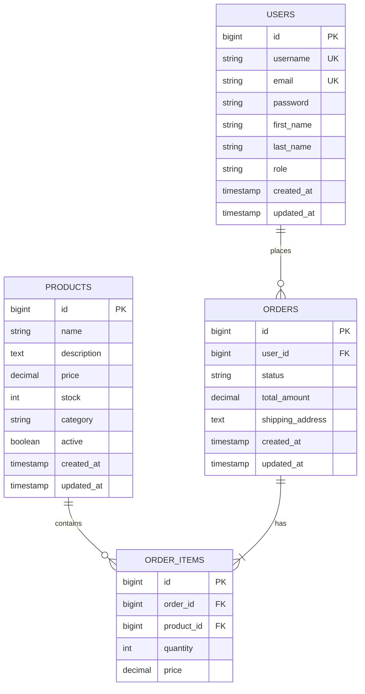
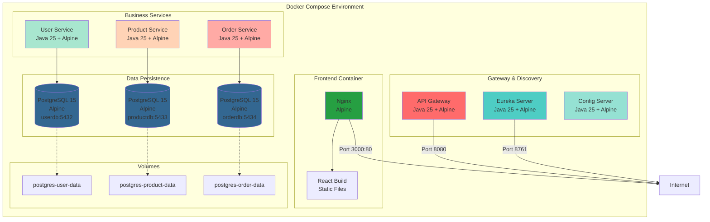
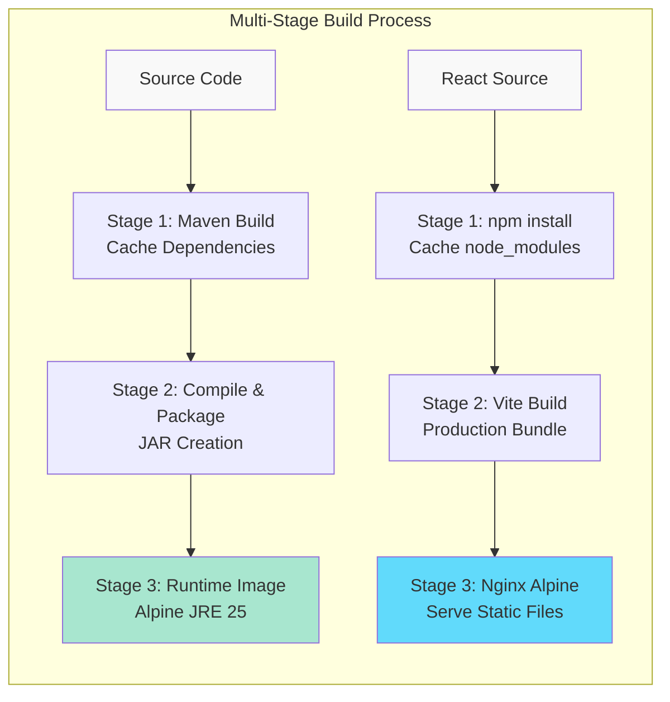

# Enterprise Microservices Application

A full-fledged microservices application with a **Java Spring Boot** backend and a **React** frontend with **3D visualization**.

---

## 🏗️ Architecture



---

## 🧱 Backend Microservices (Spring Boot 3.4.10)

### 1. Config Server (Port 8888)

* Centralized configuration for all services
* Spring Cloud Config

### 2. Eureka Server (Port 8761)

* Service discovery
* Registration and discovery of microservices
* Health checks

### 3. API Gateway (Port 8080)

* Request routing
* JWT authentication
* CORS configuration
* Rate limiting

### 4. User Service (Port 8081)

* User registration and authentication
* JWT token generation
* Profile management
* PostgreSQL database: `userdb`

### 5. Product Service (Port 8082)

* CRUD operations for products
* Pagination and filtering
* Search by category
* PostgreSQL database: `productdb`

### 6. Order Service (Port 8083)

* Creating and managing orders
* Order history
* Integration with User and Product Services via Feign Client
* PostgreSQL database: `orderdb`

---

## 🖥️ Frontend (React 18 + Vite 6)

### Technologies

* React 18.3
* Vite 6.0
* React Router v7.8
* Axios
* Zustand (state management)
* TanStack Query v5 (React Query)
* TailwindCSS 3.4
* React Hook Form
* Lucide Icons
* **Three.js 0.171** – 3D graphics
* **@react-three/fiber** – React renderer for Three.js
* **@react-three/drei** – Helpers for Three.js
* **Framer Motion 12** – Animations

### Pages

* **Home** – Landing page with a 3D hero scene
* **Demo** – 3D components and animation showcase
* **Login / Register** – Authentication
* **Products** – Product catalog with animations
* **ProductDetail** – Product details with 3D model
* **Orders** – Order history
* **Profile** – User profile

### 3D Components

* `HeroScene3D` – 3D scene for the home page
* `FloatingIcons3D` – Animated 3D icons
* `ProductModel3D` – 3D product models

### Animation Components

* `AnimatedCard` – Animated cards
* `FadeInSection` – Smooth fade-in sections
* `GradientOrb` – Animated gradient orbs
* `PageTransition` – Page transitions
* `ParticleBackground` – Particle background

---

## 🚀 Quick Start

### Prerequisites

* Docker & Docker Compose
* Java 17+ (local development)
* Node.js 18+ (local development)
* Maven 3.8+ (local development)

### Run with Docker Compose

```bash
# Clone the repository
cd /home/rachi/Documents/Project/Windsurf/Enterprise

# Enable BuildKit for optimized builds (recommended)
export DOCKER_BUILDKIT=1
export COMPOSE_DOCKER_CLI_BUILD=1

# Build and start all services
docker-compose up --build -d

# View logs
docker-compose logs -f

# Stop all services
docker-compose down

# Stop and remove volumes
docker-compose down -v
```

**Build performance:**

* First build: ~15–20 minutes
* Rebuild (after code changes): ~3–5 minutes (≈70% faster)
* See `BUILD_QUICK_START.md` and `DOCKER_OPTIMIZATION.md` for details

### Service Startup Order

1. PostgreSQL databases (auto-started via Docker)
2. Config Server
3. Eureka Server
4. User Service, Product Service, Order Service
5. API Gateway
6. Frontend

**Total startup time:** ~2–3 minutes

---

## 📡 API Endpoints

### Authentication (User Service)

```text
POST /api/auth/register - Register
POST /api/auth/login    - Login
```

### Users (User Service)

```text
GET    /api/users                         - Get all users (Admin)
GET    /api/users/{id}                    - Get user by ID
GET    /api/users/username/{username}     - Get user by username
PUT    /api/users/{id}                    - Update user
DELETE /api/users/{id}                    - Delete user (Admin)
```

### Products (Product Service)

```text
GET    /api/products                      - All products (pagination)
GET    /api/products/active               - Active products
GET    /api/products/{id}                 - Product by ID
GET    /api/products/category/{category}  - Products by category
GET    /api/products/search?name=...      - Search by name
POST   /api/products                      - Create product
PUT    /api/products/{id}                 - Update product
DELETE /api/products/{id}                 - Delete product
PATCH  /api/products/{id}/stock           - Update stock
```

### Orders (Order Service)

```text
GET    /api/orders                        - All orders (pagination)
GET    /api/orders/{id}                   - Order by ID
GET    /api/orders/user/{userId}          - Orders by user
GET    /api/orders/user/{userId}/history  - Order history
POST   /api/orders                        - Create order
PATCH  /api/orders/{id}/status            - Update status
DELETE /api/orders/{id}                   - Cancel order
```

---

## 🔄 Data Flow



---

## 🔐 Authentication

The application uses **JWT tokens** for authentication.



### Get JWT Token

```bash
curl -X POST http://localhost:8080/api/auth/login \
  -H "Content-Type: application/json" \
  -d '{
    "username": "testuser",
    "password": "password123"
  }'
```

### Use JWT Token

```bash
curl -X GET http://localhost:8080/api/users/1 \
  -H "Authorization: Bearer YOUR_JWT_TOKEN"
```

---

## 🌐 Service URLs

* **Frontend:** [http://localhost:3000](http://localhost:3000)
* **API Gateway:** [http://localhost:8080](http://localhost:8080)
* **Eureka Dashboard:** [http://localhost:8761](http://localhost:8761)
* **User Service:** [http://localhost:8081](http://localhost:8081)
* **Product Service:** [http://localhost:8082](http://localhost:8082)
* **Order Service:** [http://localhost:8083](http://localhost:8083)
* **Config Server:** [http://localhost:8888](http://localhost:8888)

### Swagger UI

* User Service: [http://localhost:8081/swagger-ui.html](http://localhost:8081/swagger-ui.html)
* Product Service: [http://localhost:8082/swagger-ui.html](http://localhost:8082/swagger-ui.html)
* Order Service: [http://localhost:8083/swagger-ui.html](http://localhost:8083/swagger-ui.html)

---

## 🗄️ Database Design



### PostgreSQL Instances

* **User DB:** `localhost:5432` (`userdb`)
* **Product DB:** `localhost:5433` (`productdb`)
* **Order DB:** `localhost:5434` (`orderdb`)

**Credentials:**

* Username: `postgres`
* Password: `postgres`

### Connect to Databases

```bash
# User DB
docker exec -it postgres-user psql -U postgres -d userdb

# Product DB
docker exec -it postgres-product psql -U postgres -d productdb

# Order DB
docker exec -it postgres-order psql -U postgres -d orderdb
```

---

## 📦 Project Structure

```text
Enterprise/
├── backend/
│   ├── config-server/
│   ├── eureka-server/
│   ├── api-gateway/
│   ├── user-service/
│   ├── product-service/
│   └── order-service/
├── frontend/
│   └── react-app/
├── docker-compose.yml
└── README.md
```

---

## 🛠️ Local Development

### Backend

```bash
# Start a specific service
cd backend/user-service
mvn spring-boot:run

# Or start via IDE (IntelliJ IDEA, Eclipse)
```

### Frontend

```bash
cd frontend/react-app

# Install dependencies
npm install

# Start dev server
npm run dev

# Build for production
npm run build
```

---

## 🔧 Configuration

### Backend

Configuration is located in each service’s `application.yml`.

**Important parameters:**

* `JWT Secret`:
  `your-secret-key-must-be-at-least-256-bits-long-for-HS256-algorithm`
* `JWT Expiration`:
  `86400000` ms (24 hours)

### Frontend

Create a `.env` file:

```env
VITE_API_URL=http://localhost:8080/api
```

---

## 📊 Monitoring

### Actuator Endpoints

All services expose Spring Boot Actuator endpoints:

```text
/actuator/health   - Health check
/actuator/info     - Service info
/actuator/metrics  - Metrics
```

### Eureka Dashboard

Monitor all registered services:

* [http://localhost:8761](http://localhost:8761)

---

## 🧪 API Testing Examples

### Create User and Order

```bash
# 1. Register user
curl -X POST http://localhost:8080/api/auth/register \
  -H "Content-Type: application/json" \
  -d '{
    "username": "john",
    "email": "john@example.com",
    "password": "password123",
    "firstName": "John",
    "lastName": "Doe"
  }'

# 2. Create product
curl -X POST http://localhost:8080/api/products \
  -H "Content-Type: application/json" \
  -H "Authorization: Bearer YOUR_TOKEN" \
  -d '{
    "name": "Laptop",
    "description": "High-performance laptop",
    "price": 999.99,
    "stock": 50,
    "category": "Electronics",
    "active": true
  }'

# 3. Create order
curl -X POST http://localhost:8080/api/orders \
  -H "Content-Type: application/json" \
  -H "Authorization: Bearer YOUR_TOKEN" \
  -d '{
    "userId": 1,
    "items": [
      {
        "productId": 1,
        "quantity": 2
      }
    ],
    "shippingAddress": "123 Main St, City"
  }'
```

---

## 🐛 Troubleshooting

### Service Does Not Start

```bash
# Check logs
docker-compose logs service-name

# Restart service
docker-compose restart service-name
```

### Database Not Available

```bash
# Check PostgreSQL status
docker-compose ps

# Recreate volumes
docker-compose down -v
docker-compose up -d
```

### Frontend Cannot Reach API

1. Check `.env` configuration
2. Verify API Gateway is running
3. Check CORS configuration in the Gateway

---

## 🚢 Deployment Architecture



---

## ⚙️ Build Optimization



**Optimizations:**

* BuildKit for parallel build
* Multi-stage builds (≈37% smaller images)
* Layer caching for dependencies
* Alpine images for minimal size
* First build: ~15–20 minutes
* Rebuild: ~3–5 minutes (~70% faster)

---

## 📝 Tech Stack

### Backend

* **Java 25** (Oracle JDK)
* **Spring Boot 3.4.10**
* **Spring Cloud 2024.0.0**
* Spring Security + JWT 0.12.3
* Spring Data JPA
* **PostgreSQL 15** (Alpine)
* **MapStruct 1.5.5**
* Lombok
* OpenAPI / Swagger
* Maven 3.9+

### Frontend

* **React 18.3**
* **Vite 6.0**
* **React Router 7.8**
* Axios 1.7
* Zustand 5.0
* **TanStack Query 5.62**
* **TailwindCSS 3.4**
* React Hook Form 7.54
* **Lucide Icons 0.469**
* **Three.js 0.171**
* **@react-three/fiber 8.17**
* **@react-three/drei 9.117**
* **Framer Motion 12.23**
* **Playwright 1.56** (E2E Testing)

### DevOps

* Docker with BuildKit
* Docker Compose 3.8
* Multi-stage builds
* Layer caching optimization
* **Nginx Alpine** (Frontend)
* **Alpine Linux** (all containers)

---

## 🎯 Key Features

### Backend

* Microservices architecture
* Service discovery (Eureka)
* API Gateway with JWT authentication
* Centralized configuration (Config Server)
* Inter-service communication via Feign Client
* Clean Architecture & DTO pattern
* Global exception handling
* Data validation
* Pagination
* Swagger documentation
* Health checks & Actuator endpoints

### Frontend

* **3D visualization** (Three.js + React Three Fiber)

  * Interactive 3D scenes
  * Animated 3D product models
  * Floating 3D icons
* **Advanced animations** (Framer Motion)

  * Page transitions
  * Animated cards
  * Gradient orbs
  * Particle backgrounds
  * Fade-in sections
* Responsive UI (mobile-first)
* Protected routes with JWT
* State management with Zustand
* API caching & optimistic updates (TanStack Query)
* Modern React patterns (hooks, context)
* Form validation (React Hook Form)
* E2E testing (Playwright)

### DevOps

* Optimized Docker builds (BuildKit)
* Multi-stage builds with caching
* Minimal runtime images (Alpine)
* Automatic dependency caching
* Parallel service builds
* Reduced image size (~37%)
* Health checks for all services
* Persistent volumes for databases

---

## 📄 License

MIT License

---

## 👨‍💻 Author

Enterprise Microservices Project
