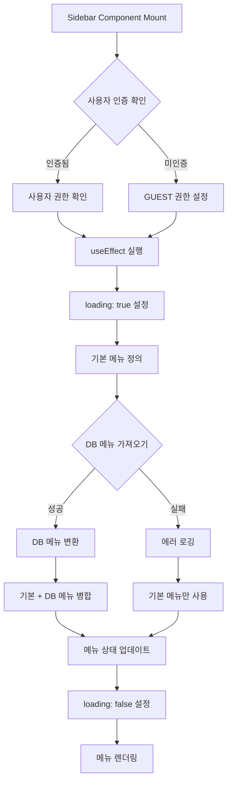
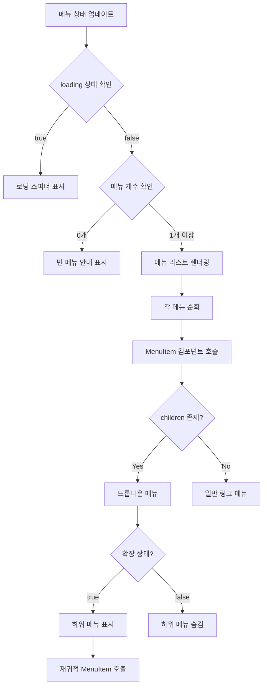
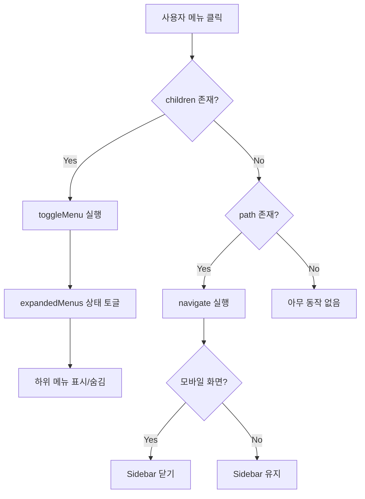
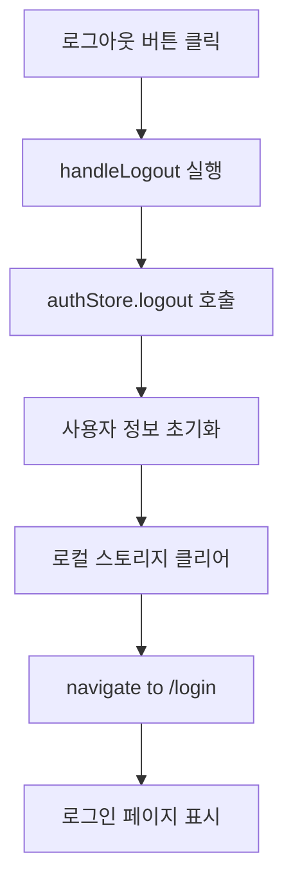
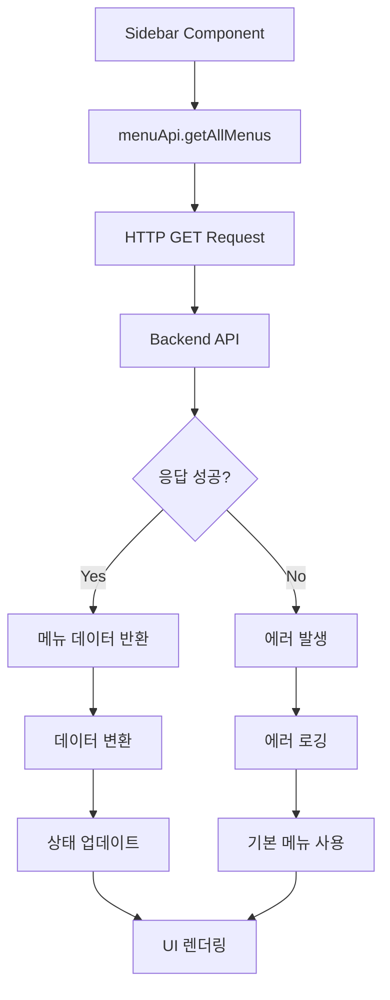

# Sidebar 메뉴 Flow 문서

## 📋 목차
1. [개요](#개요)
2. [시스템 아키텍처](#시스템-아키텍처)
3. [메뉴 로딩 Flow](#메뉴-로딩-flow)
4. [메뉴 렌더링 Flow](#메뉴-렌더링-flow)
5. [사용자 인터랙션 Flow](#사용자-인터랙션-flow)
6. [권한 관리 Flow](#권한-관리-flow)
7. [API 통신 Flow](#api-통신-flow)
8. [주요 컴포넌트](#주요-컴포넌트)

---

## 개요

이 문서는 React 기반 웹 애플리케이션의 Sidebar 메뉴 시스템의 전체 흐름을 설명합니다.

### 핵심 기능
- 🔐 **권한 기반 메뉴 표시** (GUEST, USER, MANAGER, ADMIN)
- 📊 **하이브리드 메뉴 구조** (하드코딩 + DB 동적 메뉴)
- 🎯 **계층형 메뉴** (부모-자식 메뉴 구조)
- 🔄 **동적 메뉴 확장/축소**
- 📱 **반응형 디자인** (모바일/데스크톱)

---

## 시스템 아키텍처

```
┌─────────────────────────────────────────────────────────┐
│                    Sidebar Component                     │
│                                                          │
│  ┌──────────────┐    ┌──────────────┐    ┌──────────┐ │
│  │   Header     │    │  Menu List   │    │  Footer  │ │
│  │  (User Info) │    │ (Navigation) │    │ (Logout) │ │
│  └──────────────┘    └──────────────┘    └──────────┘ │
└─────────────────────────────────────────────────────────┘
         │                      │                    │
         ▼                      ▼                    ▼
    authStore            menuApi + DB          Navigation
```

### 주요 파일 구조
```
src/components/
├── app/
│   ├── Sidebar.jsx           # 메인 사이드바 컴포넌트
│   └── authStore.js          # 인증 상태 관리
├── menu/
│   ├── menuApi.js            # 메뉴 API 서비스
│   └── menuPermissions.js    # 권한 및 메뉴 정의
```

---

## 메뉴 로딩 Flow

### 1️⃣ 초기 로딩 프로세스



### 2️⃣ 상세 로딩 코드 흐름

```javascript
// Step 1: 컴포넌트 마운트 및 초기화
const Sidebar = ({ isOpen, onClose }) => {
  const [menus, setMenus] = useState([])
  const [expandedMenus, setExpandedMenus] = useState({})
  const [loading, setLoading] = useState(true)
  const { user, logout } = useAuthStore()
  const userRole = user?.role || ROLES.GUEST

  // Step 2: useEffect로 메뉴 로딩
  useEffect(() => {
    const loadMenus = async () => {
      try {
        setLoading(true)
        
        // Step 3: 기본 메뉴 정의 (하드코딩)
        const defaultMenus = [
          { id: 'dashboard', name: '대시보드', path: '/dashboard', ... },
          { id: 'admin', name: '관리자 패널', path: '/admin', ... },
          { id: 'models', name: 'Models', path: null, children: [...] },
          // ... 더 많은 기본 메뉴
        ]
        
        // Step 4: DB에서 메뉴 가져오기
        try {
          const dbMenus = await menuApi.getAllMenus()
          
          // Step 5: DB 메뉴를 Sidebar 형식으로 변환
          const convertedDbMenus = dbMenus.map(menu => ({
            id: menu.id,
            name: menu.name,
            path: menu.path || null,
            icon: menu.icon,
            children: menu.subItems?.map(sub => ({...})) || []
          }))
          
          // Step 6: 기본 + DB 메뉴 병합
          const allMenus = [...defaultMenus, ...convertedDbMenus]
          setMenus(allMenus)
        } catch (dbError) {
          // Step 7: DB 실패 시 기본 메뉴만 사용
          console.error('DB 메뉴 로딩 실패:', dbError)
          setMenus(defaultMenus)
        }
      } finally {
        setLoading(false)
      }
    }
    
    loadMenus()
  }, [userRole])  // userRole 변경 시 재로딩
}
```

### 3️⃣ 메뉴 데이터 구조

#### 기본 메뉴 구조
```javascript
{
  id: string,           // 고유 식별자
  name: string,         // 표시 이름
  path: string | null,  // 라우팅 경로 (null이면 드롭다운)
  icon: string,         // 아이콘 이름
  roles?: string[],     // 허용 권한 목록
  children: []          // 하위 메뉴 배열
}
```

#### 예시: 계층형 메뉴
```javascript
{
  id: 'models',
  name: 'Models',
  path: null,  // path가 null이면 드롭다운
  icon: 'Brain',
  children: [
    {
      id: 'lstm',
      name: 'LSTM',
      path: '/models/lstm',
      icon: 'GitBranch'
    },
    {
      id: 'gru',
      name: 'GRU',
      path: '/models/gru',
      icon: 'Zap'
    }
  ]
}
```

---

## 메뉴 렌더링 Flow

### 1️⃣ 렌더링 프로세스



### 2️⃣ MenuItem 컴포넌트 구조

```javascript
const MenuItem = ({ menu, level = 0 }) => {
  const Icon = iconMap[menu.icon] || MenuIcon
  const hasChildren = menu.children && menu.children.length > 0
  const isExpanded = expandedMenus[menu.id]

  return (
    <div>
      {/* Case 1: 링크가 있는 메뉴 (일반 메뉴 또는 드롭다운 부모) */}
      {menu.path ? (
        <NavLink
          to={menu.path}
          className={({ isActive }) => `
            flex items-center gap-3 px-4 py-3 
            ${isActive ? 'bg-gray-700 text-white border-l-4 border-blue-500' : ''}
            ${level > 0 ? 'pl-8' : ''}  // 계층에 따라 들여쓰기
          `}
        >
          <Icon size={20} />
          <span>{menu.name}</span>
          {hasChildren && (
            isExpanded ? <ChevronDown /> : <ChevronRight />
          )}
        </NavLink>
      ) : (
        /* Case 2: 링크가 없는 메뉴 (드롭다운 전용) */
        <button onClick={() => handleMenuClick(menu)}>
          <Icon size={20} />
          <span>{menu.name}</span>
          {hasChildren && (
            isExpanded ? <ChevronDown /> : <ChevronRight />
          )}
        </button>
      )}

      {/* 하위 메뉴 (재귀적 렌더링) */}
      {hasChildren && isExpanded && (
        <div className="bg-gray-700">
          {menu.children.map(child => (
            <MenuItem key={child.id} menu={child} level={level + 1} />
          ))}
        </div>
      )}
    </div>
  )
}
```

### 3️⃣ 조건부 렌더링

```javascript
{/* 로딩 중 */}
{loading ? (
  <div className="flex flex-col items-center justify-center py-8">
    <div className="animate-spin rounded-full h-8 w-8 border-b-2 border-white" />
    <p className="text-gray-400 text-sm">메뉴 로딩 중...</p>
  </div>
) 
/* 메뉴 없음 */
: menus.length === 0 ? (
  <div className="px-4 py-8">
    <div className="bg-yellow-900 bg-opacity-20 border border-yellow-500 rounded-lg p-4">
      <p className="text-yellow-400 text-sm font-medium">메뉴가 없습니다</p>
      <p className="text-yellow-300 text-xs mt-1">
        메뉴 관리에서 메뉴를 등록하세요
      </p>
    </div>
  </div>
) 
/* 메뉴 렌더링 */
: (
  <div>
    {menus.map(menu => (
      <MenuItem key={menu.id} menu={menu} />
    ))}
  </div>
)}
```

---

## 사용자 인터랙션 Flow

### 1️⃣ 메뉴 클릭 Flow



### 2️⃣ 메뉴 클릭 핸들러

```javascript
const handleMenuClick = (menu) => {
  console.log('🖱️ [Sidebar] 메뉴 클릭:', menu.name)
  
  // Case 1: 드롭다운 메뉴 (children 있음)
  if (menu.children && menu.children.length > 0) {
    console.log('✅ [Sidebar] 하위 메뉴 있음 - 토글 실행')
    toggleMenu(menu.id)
  } 
  // Case 2: 링크 메뉴 (path 있음)
  else if (menu.path) {
    console.log('🔗 [Sidebar] 페이지 이동:', menu.path)
    navigate(menu.path)
    
    // 모바일에서는 메뉴 닫기
    if (window.innerWidth < 768) {
      onClose()
    }
  }
}
```

### 3️⃣ 메뉴 확장/축소 관리

```javascript
const toggleMenu = (menuId) => {
  console.log('🔄 [Sidebar] 메뉴 토글:', menuId)
  
  setExpandedMenus(prev => ({
    ...prev,
    [menuId]: !prev[menuId]  // 현재 상태 반전
  }))
}

// 확장 상태 예시:
// expandedMenus = {
//   'models': true,    // Models 메뉴 확장됨
//   'settings': false  // Settings 메뉴 축소됨
// }
```

### 4️⃣ 로그아웃 Flow



---

## 권한 관리 Flow

### 1️⃣ 권한 계층 구조

```
GUEST (0)      ← 최하위 권한 (비로그인)
  ↓
USER (1)       ← 일반 사용자
  ↓
MANAGER (2)    ← 중간 관리자
  ↓
ADMIN (3)      ← 최상위 관리자
```

### 2️⃣ 권한 기반 메뉴 필터링

```javascript
// menuPermissions.js
export const getFilteredMenuItems = (userRole = ROLES.GUEST, isAuthenticated = false) => {
  return menuItems
    .filter(item => {
      // 1. 권한 체크
      const hasRole = item.roles.includes(userRole)
      
      // 2. 인증 필수 메뉴 체크
      if (item.requiresAuth && !isAuthenticated) {
        return false
      }
      
      return hasRole
    })
    .sort((a, b) => a.order - b.order)
}
```

### 3️⃣ 권한별 표시 정보

```javascript
// 권한별 배지 색상
const roleBadgeColors = {
  [ROLES.GUEST]: 'bg-gray-500',      // 회색
  [ROLES.USER]: 'bg-blue-500',       // 파랑
  [ROLES.MANAGER]: 'bg-purple-500',  // 보라
  [ROLES.ADMIN]: 'bg-red-500'        // 빨강
}

// 권한별 패널 타이틀
const getHeaderTitle = () => {
  switch (user.role) {
    case ROLES.ADMIN: return 'Admin Panel'
    case ROLES.MANAGER: return 'Manager Panel'
    case ROLES.USER: return 'User Panel'
    case ROLES.GUEST: return 'Guest Panel'
    default: return 'System Panel'
  }
}
```

### 4️⃣ 메뉴 접근 권한 확인

```javascript
// 특정 메뉴 접근 가능 여부 확인
export const canAccessMenu = (menuId, userRole = ROLES.GUEST, isAuthenticated = false) => {
  const menuItem = menuItems.find(item => item.id === menuId)
  
  if (!menuItem) return false
  
  // 권한 확인
  const hasRole = menuItem.roles.includes(userRole)
  
  // 인증 필요 메뉴 확인
  if (menuItem.requiresAuth && !isAuthenticated) {
    return false
  }
  
  return hasRole
}

// 최소 권한 레벨 확인
export const hasMinimumRole = (userRole, requiredRole) => {
  return getRoleLevel(userRole) >= getRoleLevel(requiredRole)
}
```

---

## API 통신 Flow

### 1️⃣ menuApi 서비스 구조

```javascript
const menuApi = {
  // 전체 메뉴 조회
  getAllMenus: async () => {
    const response = await api.get('/admin/menus')
    return response.data
  },
  
  // 권한별 메뉴 조회
  getMenusByRole: async (role) => {
    const response = await api.get(`/admin/menus/role/${role}`)
    return response.data
  },
  
  // 메뉴 트리 구조 조회
  getMenuTree: async () => {
    const response = await api.get('/admin/menus/tree')
    return response.data
  },
  
  // 메뉴 생성/수정/삭제
  createMenu: async (menuData) => { /* ... */ },
  updateMenu: async (menuId, menuData) => { /* ... */ },
  deleteMenu: async (menuId) => { /* ... */ },
  
  // 서브메뉴 관리
  createSubMenu: async (parentId, subMenuData) => { /* ... */ },
  updateSubMenu: async (parentId, subMenuId, subMenuData) => { /* ... */ },
  deleteSubMenu: async (parentId, subMenuId) => { /* ... */ },
  
  // 메뉴 순서 변경
  updateMenuOrder: async (menuOrders) => { /* ... */ }
}
```

### 2️⃣ API 호출 Flow



### 3️⃣ 에러 처리

```javascript
try {
  const dbMenus = await menuApi.getAllMenus()
  console.log('✅ [Sidebar] DB 메뉴:', dbMenus)
  
  // 메뉴 데이터 변환
  const convertedDbMenus = dbMenus.map(menu => ({...}))
  
  // 기본 + DB 메뉴 병합
  const allMenus = [...defaultMenus, ...convertedDbMenus]
  setMenus(allMenus)
  
} catch (dbError) {
  console.error('❌ [Sidebar] DB 메뉴 로딩 실패:', dbError)
  
  // Fallback: 기본 메뉴만 사용
  setMenus(defaultMenus)
}
```

---

## 주요 컴포넌트

### 1️⃣ Sidebar 구조

```
┌─────────────────────────────────┐
│       Header (고정)              │
│  - 사용자 아바타                  │
│  - 패널 타이틀                    │
│  - 닫기 버튼 (모바일)              │
├─────────────────────────────────┤
│    Debug Info (개발용)           │
│  - 메뉴 개수 표시                 │
├─────────────────────────────────┤
│                                 │
│       Menu List (스크롤)         │
│  - Dashboard                    │
│  - Admin Panel                  │
│  - Models ▼                     │
│    - LSTM                       │
│    - GRU                        │
│  - Products                     │
│  - Orders                       │
│  - ...                          │
│                                 │
├─────────────────────────────────┤
│       Footer (고정)              │
│  - 사용자 정보                    │
│  - 권한 배지                      │
│  - 로그아웃 버튼                  │
└─────────────────────────────────┘
```

### 2️⃣ 반응형 동작

#### 데스크톱 (≥768px)
```javascript
// 항상 표시, transform 없음
className="md:static md:translate-x-0"
```

#### 모바일 (<768px)
```javascript
// 오버레이 + 슬라이드 애니메이션
{isOpen && (
  <div className="fixed inset-0 bg-black bg-opacity-50 z-20" />
)}

<aside className={`
  fixed inset-y-0 left-0 z-30 w-64
  transform transition-transform duration-300
  ${isOpen ? 'translate-x-0' : '-translate-x-full'}
`}>
```

### 3️⃣ 상태 관리

```javascript
// 컴포넌트 상태
const [menus, setMenus] = useState([])              // 메뉴 목록
const [expandedMenus, setExpandedMenus] = useState({}) // 확장 상태
const [loading, setLoading] = useState(true)        // 로딩 상태

// 외부 상태 (authStore)
const { user, logout } = useAuthStore()
const userRole = user?.role || ROLES.GUEST
```

---

## 사용 예시

### 1️⃣ 기본 사용

```jsx
import Sidebar from './components/app/Sidebar'

function App() {
  const [isSidebarOpen, setIsSidebarOpen] = useState(false)
  
  return (
    <div className="flex h-screen">
      <Sidebar 
        isOpen={isSidebarOpen} 
        onClose={() => setIsSidebarOpen(false)} 
      />
      <main className="flex-1">
        {/* 메인 콘텐츠 */}
      </main>
    </div>
  )
}
```

### 2️⃣ 새 메뉴 추가 (코드)

```javascript
// Sidebar.jsx의 defaultMenus에 추가
const defaultMenus = [
  // ... 기존 메뉴
  {
    id: 'new-menu',
    name: '새 메뉴',
    path: '/new-menu',
    icon: 'Sparkles',
    roles: [ROLES.USER, ROLES.ADMIN],  // 권한 설정
    children: []
  }
]
```

### 3️⃣ 새 메뉴 추가 (DB)

```javascript
// menuApi를 통해 DB에 메뉴 추가
await menuApi.createMenu({
  name: '새 메뉴',
  path: '/new-menu',
  icon: 'Sparkles',
  order: 10,
  roles: ['USER', 'ADMIN']
})
```

---

## 디버깅 가이드

### 1️⃣ 콘솔 로그 활용

```javascript
console.log('🔧 [Sidebar] 메뉴 로딩 시작...')
console.log('👤 [Sidebar] 현재 유저:', user)
console.log('🔑 [Sidebar] 현재 권한:', userRole)
console.log('📋 [Sidebar] 기본 메뉴:', defaultMenus.length, '개')
console.log('📦 [Sidebar] DB 메뉴:', dbMenus)
console.log('✅ [Sidebar] 변환된 DB 메뉴:', convertedDbMenus.length, '개')
console.log('🎯 [Sidebar] 전체 메뉴:', allMenus.length, '개')
```

### 2️⃣ 개발자 도구 활용

- **React DevTools**: 컴포넌트 상태 확인
- **Network Tab**: API 요청/응답 확인
- **Console**: 에러 및 로그 확인

### 3️⃣ 흔한 문제와 해결

| 문제 | 원인 | 해결 방법 |
|------|------|-----------|
| 메뉴가 표시되지 않음 | DB 연결 실패 | 기본 메뉴 fallback 확인 |
| 권한이 작동하지 않음 | user.role 없음 | authStore 상태 확인 |
| 하위 메뉴가 안 보임 | expandedMenus 상태 문제 | toggleMenu 함수 확인 |
| 아이콘이 안 보임 | iconMap 누락 | iconMap에 아이콘 추가 |

---

## 성능 최적화

### 1️⃣ 메모이제이션

```javascript
// MenuItem 컴포넌트 메모이제이션
const MenuItem = React.memo(({ menu, level = 0 }) => {
  // ...
})

// 아이콘 매핑 최적화
const iconMap = useMemo(() => ({
  'DashboardIcon': Home,
  'Brain': Brain,
  // ...
}), [])
```

### 2️⃣ 조건부 렌더링 최적화

```javascript
// 불필요한 렌더링 방지
{hasChildren && isExpanded && (
  <div className="bg-gray-700">
    {menu.children.map(child => (
      <MenuItem key={child.id} menu={child} level={level + 1} />
    ))}
  </div>
)}
```

---

## 보안 고려사항

### 1️⃣ 권한 검증

- ✅ **프론트엔드**: 메뉴 표시 제어
- ✅ **백엔드**: API 레벨 권한 검증 (필수)

### 2️⃣ 민감 정보 보호

```javascript
// ❌ 잘못된 예
console.log('User token:', user.token)

// ✅ 올바른 예
console.log('User role:', user.role)
```

---

## 확장 가능성

### 1️⃣ 향후 개선 사항

- [ ] 메뉴 검색 기능
- [ ] 즐겨찾기 메뉴
- [ ] 메뉴 개인화 설정
- [ ] 다국어 지원
- [ ] 드래그 앤 드롭 순서 변경
- [ ] 메뉴 아이콘 커스터마이징

### 2️⃣ 플러그인 시스템

```javascript
// 플러그인 메뉴 동적 추가
const pluginMenus = await loadPluginMenus()
const allMenus = [...defaultMenus, ...dbMenus, ...pluginMenus]
```

---

## 참고 자료

- [React Router Documentation](https://reactrouter.com/)
- [Lucide React Icons](https://lucide.dev/)
- [Tailwind CSS](https://tailwindcss.com/)
- [Zustand (State Management)](https://github.com/pmndrs/zustand)

---

## 버전 히스토리

| 버전 | 날짜 | 변경 사항 |
|------|------|-----------|
| 1.0.0 | 2024-01 | 초기 버전 |
| 1.1.0 | 2024-02 | DB 메뉴 통합 |
| 1.2.0 | 2024-03 | 권한 시스템 개선 |

---

**문서 작성일**: 2024-01-07  
**작성자**: Development Team  
**최종 수정일**: 2024-01-07
