```mermaid
graph LR
    A[IoT Device] -->|MQTT Publish| B[AWS IoT Core]
    B -->|Topic: device/topic/+| C[mqtt-service]
    C -->|MqttMessageListener| D[Base64 Decode]
    D -->|Parse Message Type| E[Create MqttMessage DTO]
    E -->|KafkaProducerService| F[Kafka Topic]
    F -->|device.data.topic| G[message-service]
    G -->|IoTDeviceMessageConsumer| H[Process Data]
```

# IoT 메시지 흐름 통합 가이드

## 📊 아키텍처 개요

```
IoT Device ←→ AWS IoT Core ←→ mqtt-service ←→ Kafka ←→ message-service
```

### 메시지 흐름

#### 1️⃣ **IoT → Backend (데이터 수신)**
```
IoT Device → AWS IoT Core → mqtt-service → Kafka Topic → message-service
```

#### 2️⃣ **Backend → IoT (명령 전송)**
```
message-service → Kafka Topic → mqtt-service → AWS IoT Core → IoT Device
```

---

## 🔄 상세 메시지 흐름

### 📥 IoT 디바이스에서 데이터 수신



**처리 과정:**

1. **IoT Device**: AWS IoT Core로 MQTT 메시지 발행
   - Topic: `device/topic/B0/{deviceId}`
   - Payload: Base64 인코딩된 바이너리 데이터

2. **mqtt-service (MqttMessageListener)**:
   - MQTT 메시지 수신 (QoS 0)
   - Base64 디코딩
   - 메시지 타입 파싱 (byte[4])
   - `MqttMessage` DTO 생성

3. **mqtt-service (KafkaProducerService)**:
   - 메시지 타입에 따라 Kafka 토픽 결정
   - Kafka로 JSON 메시지 전송

4. **message-service (IoTDeviceMessageConsumer)**:
   - Kafka에서 메시지 수신
   - 메시지 타입별 처리
     - PERIODIC: 주기적 센서 데이터
     - DISCRETE: 이벤트성 데이터
     - REQUEST: 디바이스 등록 요청
     - RESPONSE: 응답
     - FOTA: 펌웨어 업데이트 상태
     - REBOOT: 재시작 완료

### 📤 IoT 디바이스로 명령 전송

```mermaid
graph LR
    A[REST API] -->|POST /api/iot/command| B[message-service]
    B -->|IoTCommandProducer| C[Kafka Topic]
    C -->|mqtt.command.topic| D[mqtt-service]
    D -->|MqttCommandConsumer| E[Create PublishRequest]
    E -->|MqttPublishService| F[AWS IoT MQTT Client]
    F -->|Topic: device/topic/A0/{deviceId}| G[AWS IoT Core]
    G -->|MQTT Subscribe| H[IoT Device]
```

**처리 과정:**

1. **REST API 호출**:
   ```bash
   POST /api/iot/command
   {
     "deviceId": "DEVICE_001",
     "messageType": "ECHO",
     "payload": "base64EncodedMessage",
     "qos": 0,
     "topicType": "REQUEST"
   }
   ```

2. **message-service (IoTCommandProducer)**:
   - `IoTCommandDto` 생성
   - Kafka Topic `mqtt.command.topic`으로 발행

3. **mqtt-service (MqttCommandConsumer)**:
   - Kafka에서 명령 수신
   - `PublishRequest` 변환

4. **mqtt-service (MqttPublishService)**:
   - AWS IoT MQTT Client로 발행
   - Topic: `device/topic/A0/{deviceId}`

5. **IoT Device**:
   - MQTT Subscribe로 명령 수신
   - 명령 실행

---

## 📋 Kafka Topic 구성

### MQTT → Message (IoT 데이터)

| Topic | 용도 | 메시지 타입 |
|-------|------|------------|
| `device.data.topic` | 센서 데이터 | PERIODIC, DISCRETE, ECHO |
| `device.request.topic` | 디바이스 등록 | REQUEST |
| `device.response.topic` | 응답 | RESPONSE |
| `device.fota.topic` | 펌웨어 업데이트 | FOTA |
| `device.reboot.topic` | 재시작 | REBOOT |

### Message → MQTT (IoT 명령)

| Topic | 용도 |
|-------|------|
| `mqtt.command.topic` | IoT 디바이스 제어 명령 |

---

## 🛠️ 주요 코드 변경사항

### 1. mqtt-service

#### 새로 추가된 파일:
- `MqttCommandDto.java`: Kafka 명령 수신 DTO
- `MqttCommandConsumer.java`: Kafka 명령 Consumer
- `KafkaConsumerConfig.java`: Kafka Consumer 설정

#### 수정된 파일:
- `application.yml`: `mqtt-command` 토픽 추가
- `KafkaConfig.java`: `mqttCommandTopic` Bean 추가
- `build.gradle`: Kafka 의존성 추가

### 2. message-service

#### 새로 추가된 파일:
- `dto/iot/IoTDeviceMessageDto.java`: IoT 메시지 DTO
- `dto/iot/IoTCommandDto.java`: IoT 명령 DTO
- `kafka/IoTDeviceMessageConsumer.java`: IoT 메시지 Consumer
- `kafka/IoTCommandProducer.java`: IoT 명령 Producer
- `controller/IoTDeviceController.java`: IoT 제어 REST API

#### 수정된 파일:
- `application.yml`: IoT 관련 Kafka 토픽 추가

---

## 🚀 실행 방법

### 1. 필수 조건

- Docker & Docker Compose
- AWS IoT Core 설정 (Thing, Certificate, Policy)
- Kafka 실행 중

### 2. 인증서 설정

mqtt-service의 `certs/` 디렉토리에 AWS IoT 인증서 배치:
```
certs/
├── certificate.pem.crt
├── private.pem.key
└── AmazonRootCA1.pem
```

### 3. Docker Compose 실행

```bash
# 전체 서비스 시작
docker-compose up -d

# 로그 확인
docker-compose logs -f mqtt-service message-service
```

### 4. 개별 서비스 실행

#### mqtt-service
```bash
cd mqtt-service
./gradlew bootRun
```

#### message-service
```bash
cd message-service
./gradlew bootRun
```

---

## 📡 API 사용 예제

### 1. IoT 명령 전송

#### Echo 명령 (테스트용)
```bash
curl -X POST http://localhost:8086/api/iot/echo/DEVICE_001 \
  -H "Content-Type: text/plain" \
  -d "SGVsbG8gRGV2aWNl"  # Base64: "Hello Device"
```

#### FOTA 명령 (펌웨어 업데이트)
```bash
curl -X POST http://localhost:8086/api/iot/fota/DEVICE_001 \
  -H "Content-Type: text/plain" \
  -d "base64EncodedFirmwareData"
```

#### Reboot 명령
```bash
curl -X POST http://localhost:8086/api/iot/reboot/DEVICE_001 \
  -H "Content-Type: text/plain" \
  -d "base64EncodedRebootCommand"
```

#### 일반 명령
```bash
curl -X POST http://localhost:8086/api/iot/command \
  -H "Content-Type: application/json" \
  -d '{
    "deviceId": "DEVICE_001",
    "messageType": "NTP",
    "payload": "base64EncodedPayload",
    "qos": 0,
    "topicType": "REQUEST"
  }'
```

### 2. 응답 예시

```json
{
  "success": true,
  "commandId": "550e8400-e29b-41d4-a716-446655440000",
  "deviceId": "DEVICE_001",
  "messageType": "ECHO",
  "message": "Command sent successfully"
}
```

---

## 🔍 모니터링

### 1. Kafka UI
```
http://localhost:8090
```
- Kafka 토픽 모니터링
- 메시지 확인
- Consumer 그룹 상태

### 2. Swagger UI

**mqtt-service**:
```
http://localhost:8088/swagger-ui.html
```

**message-service**:
```
http://localhost:8086/swagger-ui.html
```

### 3. Actuator

**mqtt-service**:
```
http://localhost:8088/actuator/health
http://localhost:8088/actuator/metrics
```

**message-service**:
```
http://localhost:8086/actuator/health
http://localhost:8086/actuator/metrics
```

---

## 📊 메시지 타입별 처리

### IoT → Backend

| 타입 | 코드 | Kafka Topic | 설명 |
|------|------|-------------|------|
| PERIODIC | 0 | device.data.topic | 주기적 센서 데이터 (온도, 습도 등) |
| DISCRETE | 1 | device.data.topic | 이벤트성 데이터 (알람, 감지 등) |
| REQUEST | 2 | device.request.topic | 디바이스 등록/인증 요청 |
| RESPONSE | 3 | device.response.topic | 명령 실행 결과 |
| ECHO | 5 | device.data.topic | 테스트용 Echo |
| FOTA | 6 | device.fota.topic | 펌웨어 업데이트 진행 상황 |
| REBOOT | 7 | device.reboot.topic | 재시작 완료 알림 |

### Backend → IoT

모든 명령은 `mqtt.command.topic`을 통해 전송되며, 다음 타입을 지원:
- ECHO: 테스트
- FOTA: 펌웨어 업데이트 시작
- REBOOT: 재시작 명령
- NTP: 시간 동기화

---

## 🔧 트러블슈팅

### 1. MQTT 연결 실패

**증상**: mqtt-service가 AWS IoT에 연결되지 않음

**해결방법**:
```bash
# 인증서 확인
ls -l mqtt-service/certs/

# 인증서 권한 확인
chmod 600 mqtt-service/certs/*.key

# AWS IoT Endpoint 확인
# application.yml의 aws.iot.endpoint 확인
```

### 2. Kafka 메시지 수신 안됨

**증상**: message-service가 IoT 메시지를 받지 못함

**해결방법**:
```bash
# Kafka 토픽 확인
docker exec -it kafka kafka-topics --bootstrap-server localhost:9092 --list

# Consumer 그룹 확인
docker exec -it kafka kafka-consumer-groups --bootstrap-server localhost:9092 --list

# 메시지 확인
docker exec -it kafka kafka-console-consumer \
  --bootstrap-server localhost:9092 \
  --topic device.data.topic \
  --from-beginning
```

### 3. 명령 전송 실패

**증상**: REST API는 성공하지만 IoT 디바이스가 명령을 받지 못함

**해결방법**:
```bash
# mqtt-service 로그 확인
docker logs -f mqtt-service

# Kafka 명령 토픽 확인
docker exec -it kafka kafka-console-consumer \
  --bootstrap-server localhost:9092 \
  --topic mqtt.command.topic \
  --from-beginning

# AWS IoT Core 로그 확인 (CloudWatch)
```

---

## 📝 개발 가이드

### 새로운 메시지 타입 추가

1. **Enum 추가**:
   ```java
   // MqttMessage.java, IoTDeviceMessageDto.java
   public enum MessageType {
       // ... 기존 타입들
       NEW_TYPE(9)  // 새로운 타입
   }
   ```

2. **Kafka 토픽 추가** (선택사항):
   ```yaml
   # application.yml
   kafka:
     topics:
       new-type: device.newtype.topic
   ```

3. **Consumer 처리 추가**:
   ```java
   // IoTDeviceMessageConsumer.java
   @KafkaListener(topics = "${kafka.topic.new-type}")
   public void consumeNewType(String messageJson) {
       // 처리 로직
   }
   ```

4. **Producer 메서드 추가**:
   ```java
   // IoTCommandProducer.java
   public CompletableFuture<SendResult> sendNewTypeCommand(
           String deviceId, String payload) {
       // 발행 로직
   }
   ```

### 비즈니스 로직 추가

`IoTDeviceMessageConsumer.java`의 처리 메서드에서 구현:

```java
private void processPeriodicData(IoTDeviceMessageDto message) {
    // 1. 데이터 파싱
    // 2. DB 저장
    // 3. 이상 감지
    // 4. 알림 발송
}
```

---

## 📚 참고 자료

- [AWS IoT Core 문서](https://docs.aws.amazon.com/iot/)
- [Apache Kafka 문서](https://kafka.apache.org/documentation/)
- [Spring Kafka 문서](https://spring.io/projects/spring-kafka)

---

## ✅ 체크리스트

### 초기 설정
- [ ] AWS IoT Thing 생성
- [ ] 인증서 발급 및 `certs/` 디렉토리 배치
- [ ] IoT Policy 설정
- [ ] Kafka 실행 확인

### 서비스 시작
- [ ] mqtt-service 정상 시작
- [ ] message-service 정상 시작
- [ ] Kafka 토픽 자동 생성 확인
- [ ] Eureka 서비스 등록 확인

### 테스트
- [ ] IoT 디바이스에서 메시지 수신 확인
- [ ] Kafka에서 메시지 확인
- [ ] message-service에서 처리 로그 확인
- [ ] REST API로 명령 전송 테스트
- [ ] IoT 디바이스에서 명령 수신 확인

---

## 🎯 다음 단계

1. **데이터 파싱 구현**: Base64 메시지를 구조화된 데이터로 변환
2. **DB 연동**: 디바이스 데이터 영구 저장
3. **알림 시스템**: 이상 감지 시 알림 발송
4. **대시보드**: 실시간 디바이스 모니터링 UI
5. **보안 강화**: 디바이스 인증 및 암호화

---

**문의사항이나 이슈가 있으면 개발팀에 연락하세요.**
